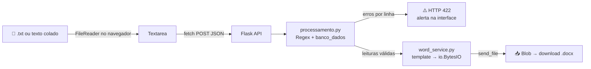

<div align="center">

# 📖 Separador de Leituras

[](https://opensource.org/licenses/MIT)

**Aplicação web para classificar referências bíblicas litúrgicas e gerar documentos Word (`.docx`) automatizados.**

[](https://separador-de-leituras.onrender.com/)


🌐 **Acesse agora:** [separador-de-leituras.onrender.com](https://separador-de-leituras.onrender.com/)

</div>

> [!NOTE]
> O projeto está no plano gratuito do Render. Depois de um período sem uso, o primeiro acesso pode levar alguns segundos enquanto o servidor "acorda".

---

## 📑 Índice

- [Visão Geral](#-visão-geral)
- [Funcionalidades](#-funcionalidades)
- [Arquitetura e Destaques Técnicos](#️-arquitetura-e-destaques-técnicos)
- [Estrutura do Projeto](#-estrutura-do-projeto)
- [API](#-api)
- [Instalação e Execução Local](#-instalação-e-execução-local)
- [Testes](#-testes)
- [Deploy](#️-deploy)
- [Como Contribuir](#-como-contribuir)
- [Licença](#-licença)
- [Autor](#-autor)

---

## 🔎 Visão Geral

Preparar as leituras de uma celebração da Palavra significa separar dezenas de referências bíblicas por tipo de livro e passá-las a limpo numa tabela. O **Separador de Leituras** automatiza esse trabalho:

1. **Lê** referências bíblicas no formato usado no dia a dia (ex.: `GN 11`, `MT 1, 14`, `1Cor 1,27-28`).
2. **Classifica** cada uma, com **Expressões Regulares** e um mapeamento dos 73 livros da Bíblia Católica, em quatro categorias litúrgicas:

   | Categoria | Exemplos de livros |
   |---|---|
   | 📜 **Históricos** | Gênesis, Êxodo, Josué, Juízes, Samuel, Atos |
   | 🔥 **Profetas** | Isaías, Jeremias, Ezequiel, Daniel, Salmos, Jó |
   | ✉️ **Cartas** | Romanos, Coríntios, Hebreus, Apocalipse |
   | ✝️ **Evangelho** | Mateus, Marcos, Lucas, João |

3. **Resolve ambiguidades**, como a de **Jó** e **João**, que costumam ter a mesma abreviação. A regra é explícita: `Jo` é João, `Jó` ou `Job` é Jó, e `1Jo`, `2Jo` e `3Jo` são as cartas de João.
4. **Gera** um arquivo `.docx` a partir de um template Word, com as leituras organizadas numa tabela pronta para impressão. Se houver mais leituras do que linhas no template, a tabela cresce sozinha.

---

## ✨ Funcionalidades

| | Funcionalidade | Descrição |
|---|---|---|
| 📋 | **Entrada flexível** | Cole as referências na caixa de texto ou carregue um arquivo `.txt`. |
| 👀 | **Pré-visualização** | Veja as leituras distribuídas nas 4 colunas antes de gerar o documento. |
| 🚨 | **Tratamento de erros** | Siglas desconhecidas aparecem num alerta com o **número da linha**. Clique no erro e a linha é selecionada no texto para você corrigir. |
| ⏭️ | **Ignorar linhas inválidas** | Opção para gerar o documento mesmo com linhas não reconhecidas, que são descartadas. |
| 🔤 | **Formato de saída** | **Abreviado** (`Gn 12,1`) ou **Completo** (`Gênesis 12,1`). |
| 📥 | **Download direto** | O `.docx` é baixado automaticamente, sem páginas intermediárias. |
| 🌙 | **Dark Mode e responsivo** | Segue o tema do sistema e funciona no celular. |

---

## 🏗️ Arquitetura e Destaques Técnicos

### Stack

| Camada | Tecnologias |
|---|---|
| **Backend** | Python 3.12, Flask, Gunicorn, python-docx |
| **Frontend** | HTML5, CSS3 (responsivo, Dark Mode via `prefers-color-scheme`), JavaScript Vanilla |
| **Infraestrutura** | Render (PaaS), `render.yaml` e `Procfile` |

### Fluxo da aplicação



### 🧠 Destaques

- **Arquitetura stateless.** O documento Word é montado inteiramente na memória do servidor com `io.BytesIO` e devolvido ao navegador como um Blob. **Nenhum dado do usuário nem arquivo gerado é salvo em disco.** O template é lido uma única vez e mantido em cache. Por isso a aplicação escala horizontalmente sem esforço e roda bem em PaaS gratuitas e ambientes serverless.
- **Arquivo processado no navegador.** O `.txt` é lido no navegador com a File API e colocado na caixa de texto. O arquivo não precisa ir para o servidor, e o usuário pode revisar e corrigir o conteúdo antes de enviar.
- **Separação de responsabilidades.** Cada módulo tem uma única função:
  - `banco_dados.py`: dados e configuração.
  - `processamento.py`: regras de negócio (regex e classificação).
  - `word_service.py`: geração do documento.
  - `main.py`: camada HTTP.
- **Erros tratados como dados.** Em vez de falhar sem aviso, a API devolve **HTTP 422** com a lista `{linha, texto}` de cada problema, e a interface transforma isso em alertas clicáveis.
- **Template dinâmico.** A tabela do Word é localizada pelos cabeçalhos, não por posição fixa. Isso deixa o template livre para mudanças de layout.

---

## 📂 Estrutura do Projeto

```text
Separador-de-Leituras/
├── src/
│   ├── main.py             # App Flask: rotas e camada HTTP
│   ├── banco_dados.py      # Mapeamento dos 73 livros → (nome, categoria)
│   ├── processamento.py    # Classificação via regex, agrupamento por categoria
│   ├── word_service.py     # Preenchimento do template .docx em memória
│   ├── templates/
│   │   └── index.html      # Interface
│   └── static/
│       ├── style.css       # Estilos (responsivo + dark mode)
│       └── app.js          # Upload, fetch, preview, download do Blob
├── tests/
│   └── test_app.py         # Testes unitários e de rotas
├── leituras.docx           # Template Word da tabela
├── requirements.txt
├── render.yaml             # Infraestrutura como código (Render)
└── Procfile                # Comando de start (Railway/Heroku)
```

---

## 🔌 API

| Método | Rota | Corpo (JSON) | Resposta |
|---|---|---|---|
| `GET` | `/` | — | Página da aplicação |
| `POST` | `/api/processar` | `{ "texto", "formato" }` | `{ resumo, erros, total }` para a pré-visualização |
| `POST` | `/api/gerar` | `{ "texto", "formato", "ignorar_desconhecidas" }` | Arquivo `.docx`, ou **422** com `{ mensagem, erros }` |

`formato` aceita `"abreviado"` ou `"completo"`.

<details>
<summary>Exemplo de requisição</summary>

```bash
curl -X POST https://separador-de-leituras.onrender.com/api/processar \
  -H "Content-Type: application/json" \
  -d '{"texto": "Jo 3,16\nJó 19,25\nXx 1", "formato": "completo"}'
```

```json
{
  "resumo": {
    "Históricos": [],
    "Profetas": ["Jó 19,25"],
    "Cartas": [],
    "Evangelho": ["João 3,16"]
  },
  "erros": [{ "linha": 3, "texto": "Xx 1" }],
  "total": 2
}
```

</details>

---

## 💻 Instalação e Execução Local

**Pré-requisitos:** Python 3.12+ e Git.

```bash
# 1. Clone o repositório
git clone https://github.com/EmivaltoJrr/Separador-de-Leituras.git
cd Separador-de-Leituras

# 2. Crie e ative o ambiente virtual
python3 -m venv venv
source venv/bin/activate        # Linux / macOS / WSL
# venv\Scripts\activate         # Windows

# 3. Instale as dependências
pip install -r requirements.txt

# 4. Inicie o servidor de desenvolvimento
python src/main.py
```

Acesse **http://127.0.0.1:5000** no navegador. 🎉

Para rodar localmente como em produção, com Gunicorn (Linux, macOS ou WSL):

```bash
gunicorn --chdir src main:app --bind 0.0.0.0:8000 --workers 2
```

---

## 🧪 Testes

```bash
python -m unittest discover -s tests
```

A suíte cobre:
- a desambiguação **Jo / Jó / Job / 1Jo**;
- a correspondência entre as categorias e as colunas do template;
- o número da linha nos erros;
- as rotas HTTP, incluindo o **422** para siglas desconhecidas;
- a geração de um `.docx` válido em memória, a partir de um conjunto real de leituras.

---

## ☁️ Deploy

O projeto usa **infraestrutura como código** para Continuous Deployment no [Render](https://render.com):

- **[`render.yaml`](render.yaml)** (Blueprint): define o serviço web, o comando de build, o comando de start com Gunicorn e a versão do Python. A cada `git push` na branch principal, o Render gera um novo build e publica automaticamente.
- **[`Procfile`](Procfile)**: o mesmo comando de start, compatível com Railway, Heroku e outras PaaS.

**Para publicar seu próprio fork:**
1. Faça um fork deste repositório.
2. No painel do Render, clique em **New → Blueprint** e selecione o fork.
3. Confirme. O Render lê o `render.yaml` e publica a aplicação.

```yaml
# render.yaml
services:
  - type: web
    name: separador-de-leituras
    runtime: python
    plan: free
    buildCommand: pip install -r requirements.txt
    startCommand: gunicorn --chdir src main:app --bind 0.0.0.0:$PORT --workers 2
```

---

## 🤝 Como Contribuir

Contribuições são bem-vindas! 💙

1. Faça um **fork** do projeto.
2. Crie uma branch para a sua alteração:
   ```bash
   git checkout -b feat/minha-melhoria
   ```
3. Faça as alterações e **rode os testes**:
   ```bash
   python -m unittest discover -s tests
   ```
4. Faça commit seguindo o padrão [Conventional Commits](https://www.conventionalcommits.org/pt-br/):
   ```bash
   git commit -m "feat: adiciona sigla alternativa para Eclesiástico"
   ```
5. Envie a branch e abra um **Pull Request** descrevendo o que mudou e por quê.

💡 **Ideias de contribuição:**
- novas variações de siglas em `banco_dados.py`;
- mais casos de teste;
- melhorias de acessibilidade na interface;
- suporte a outros modelos de documento.

Encontrou um problema? Abra uma [issue](https://github.com/EmivaltoJrr/Separador-de-Leituras/issues).

---

## 📄 Licença

Distribuído sob a licença **MIT**. Veja o arquivo [`LICENSE`](LICENSE) para mais detalhes.

---

## 👤 Autor

**Emivalto da Costa Tavares Junior**

[](https://github.com/EmivaltoJrr)

<div align="center">

⭐ Se este projeto foi útil para você, deixe uma estrela no repositório!

</div>
